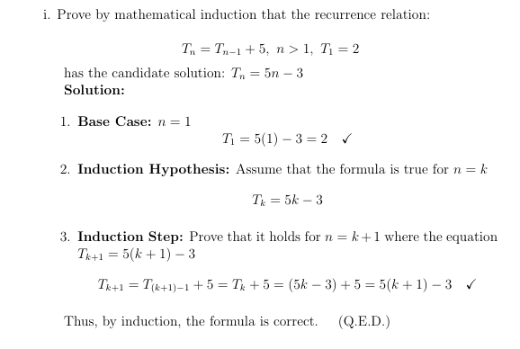
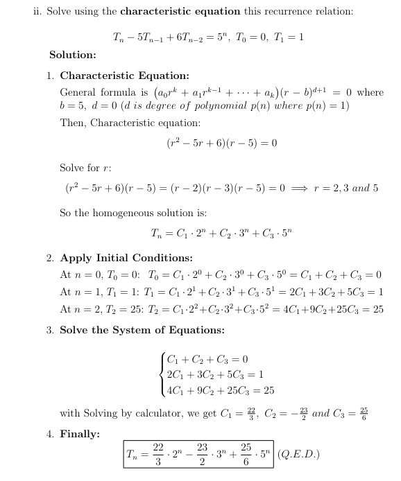

# Algorithms in Java (CS305) - Spring 2026

This repository contains course tasks and quizzes for Algorithms in Java (CS305).

---

# Task 1 (15 Feb)

 * Write a Java method that reads words from a file using Scanner and checks whether each word contains only distinct (non-repeating) characters.
 Return true if all words are valid, otherwise return false if any word contains duplicate letters.
 ## Example 1:
 * Input file: omar 
               ahmed
               mahmoud
 * Output: false (because "mahmoud" contains repeated letter 'm')
 ## Example 2:
 * Input file: omar 
               ahmed
               omar
 * Output: true (because each word individually contains only distinct (non-repeating) letters)

---

# Quiz 1 (22 Feb)

 * Write a Java method that takes an int array as a parameter and returns a new array containing only the elements that are greater than 5.
 ## Example 1:
 * Input: [1,9,3,8,10,4,5]
 * Output: [9,8,10]
 ## Example 2:
 * Input file: [4,9,10,5,2,8,6,9]
 * Output: [9,10,8,6,9]

---

# Task 2 (1 Mar)

 * Write a Java method that takes an int array as a parameter and returns the sum of its elements using recursion with two pointers.
 ## Example 1:
 * Input: [1,9,3,8,10,4]
 * Output: 35
 ## Example 2:
 * Input file: [1,2,3,4,5]
 * Output: 15

---

# Quiz 2 (8 Mar) 
1) Prove by mathematical induction that recurrence equation T_n = T_{n-1} + 5 ,  n > 1 and T_1 = 2 has a candidate solution T_n = 5n - 3
   
2) Solve by Characteristic Equation this recurrence equation T_n - 5 T_n-1 + T_n-2 = 5^n where t_0 = 0 and t_1 = 1
   