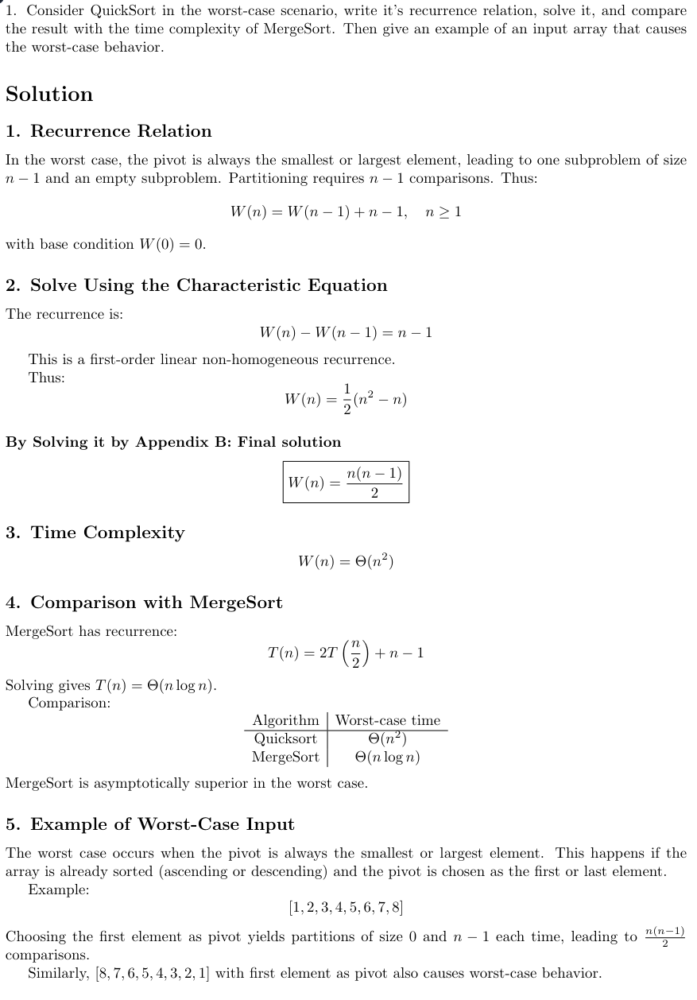
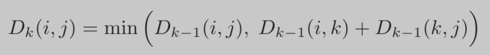
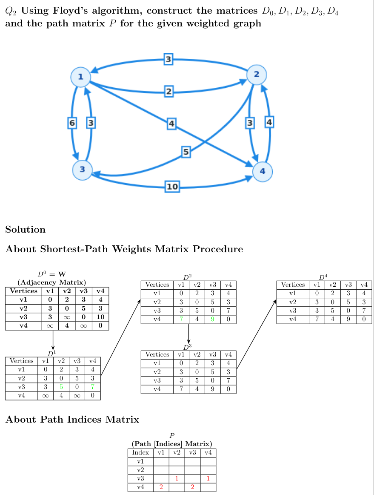

# Algorithms in Java (CS305) - Spring 2026

This repository contains course tasks and quizzes for Algorithms in Java (CS305).

🗂️ Repository Structure
```
cs305-algo/
├── src/
│   └── Quiz_1/
│       └── Quiz1.java
│   └── Quiz_2/
│       └── Q1.png
│       └── Q2.png
│   └── Quiz_3/
│       └── Quiz3_Q1.png
│       └── Quiz3_Q2.java
│   └── Quiz_4/
│       └── Quiz4_Q1.java
│       └── Quiz4_Q2.java
│       └── Quiz4_Q2.png
│       └── Quiz4_Q2_Rule.png
│   └── Task_1/
│       └── Task1.java
│   └── Task_2/
│       └── Task2.java
│   └── Task_3/
│       └── Task3.java
│   └── Task_4/
│       └── Task4.java
│   └── ...
...
```

---

# Task 1 (15 Feb)

 * Write a Java method that reads words from a file using Scanner and checks whether each word contains only distinct (non-repeating) characters.
 Return true if all words are valid, otherwise return false if any word contains duplicate letters.
 ## Example 1:
 * Input file: omar 
               ahmed
               mahmoud
 * Output: false (because "mahmoud" contains repeated letter 'm')
 ## Example 2:
 * Input file: omar 
               ahmed
               omar
 * Output: true (because each word individually contains only distinct (non-repeating) letters)

---

# Quiz 1 (22 Feb)

 * Write a Java method that takes an int array as a parameter and returns a new array containing only the elements that are greater than 5.
 ## Example 1:
 * Input: [1,9,3,8,10,4,5]
 * Output: [9,8,10]
 ## Example 2:
 * Input file: [4,9,10,5,2,8,6,9]
 * Output: [9,10,8,6,9]

---

# Task 2 (1 Mar)

 * Write a Java method that takes an int array as a parameter and returns the sum of its elements using recursion with two pointers.
 ## Example 1:
 * Input: [1,9,3,8,10,4]
 * Output: 35
 ## Example 2:
 * Input file: [1,2,3,4,5]
 * Output: 15

---

# Quiz 2 (8 Mar) 
1) Quiz 2 - First Question<br><br>
<br><br>
2) Quiz 2 - Second Question<br><br>


---

# Task 3 (15 Mar)

 * Write a Java method that takes a sorted int array (may contain duplicates) and a target value, and returns the first and last position of the target in int array using binary search and (divide & conquer) technique.
 ## Example 1:
 * Input: [1, 2, 3], target = 3
 * Output: [2, 2]
 * Explanation: Target 3 appears only at index 2
 ## Example 2:
 * Input: [1, 2, 3, 3, 4], target = 3
 * Output: [2, 3]
 * Explanation: Target 3 appears at indices 2 and 3
 ## Example 3:
 * Input: [1, 2, 3, 4, 5], target = 6
 * Output: [-1, -1]
 * Explanation: Target 6 not found in array
---

# Quiz 3 (5 Apr)

1) Quiz 3 - First Question<br>
<br><br>

2) Quiz 3 - Second Question
* Using the Divide and Conquer approach, write a method that checks if an array is sorted in ascending order or not.
## Example 1:
* Input: [1, 2, 3, 4]
* Output: true
## Example 2:
* Input: [1, 2, 3, 3, 4]
* Output: true
## Example 3:
* Input: [1, 2, 5, 3]
* Output: false
* Explanation: not sorted due to 5 > 3 NOT 5 <= 3
---

# Task 4 (12 Apr)

* Using Floyd's algorithm, update it to handle a graph that contains cycles such that it computes the minimum cycle weight in the graph (assuming all edge weights are positive).
## Example 1:
* Input: `n = 4` and
```
W (Adjacency Matrix) =
            { 0 ,INF, 7 ,INF}
            { 3 , 0 , 1 ,INF}
            {INF, 2 , 0 ,INF}
            { 3 , 6 ,INF, 0 }
```
* Output: 3
* Explanation: cycle weights are `[12, 3, 3, INF]` & Min Cycle Weight are 3.
## Example 2:
* Input: `n = 5` and
```
W (Adjacency Matrix) =
            { 0 ,INF, 7 ,INF, 8 }
            { 8 , 0 , 1 ,INF, 5 }
            {INF, 8 , 0 ,INF, 3 }
            {INF, 6 ,INF, 0 ,INF}
            { 6 ,INF, 8 ,INF, 0 }
```
* Output: 9
* Explanation: cycle weights are `[14, 9, 9, INF, 11]` & Min Cycle Weight are 9.
## Example 3:
* Input: `n = 3` and
```
W (Adjacency Matrix) =
            { 0 ,INF, 7 }
            {INF, 0 ,INF}
            {INF, 8 , 0 }
```
* Output: -1
* Explanation: cycle weights are `[INF, INF, INF]` & no cycles appeared, so -1 = NOT FOUND.
---

# Quiz 4 (19 Apr)

1) Quiz 4 - First Question
* using the Divide and Conquer approach & Dynamic Programming approach, Implement the factorial method in both approaches, then compare the time complexity between them (Don't prove anything)
## Example 1:
* Input: 5
* Output: 120
## Example 2:
* Input: 6
* Output: 720
## Note: The whole solution is in the java class `Quiz4_Q1.java`
2) Quiz 4 - Second Question
- Note: we have a java class `Quiz4_Q2.java` for checking answer if you want
   
   <br><br>
---
